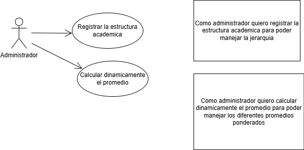

# DOSW_ParcialT1_MarianaParra
ANDREA MARIANA PARRA URREGO
GRUPO 1

### Primer punto (Enunciado 2)

### Segundo punto (patrones)
1.
a.Nombre del Patrón: Bridge

b. Tipo de patrón (creacional, estructural o de comportamiento): estructural

c. Justificación de la decisión
Para todos hay que calcular un promedio y esto sria lo que los hace extrechamente relacionados
por estudiante, grupo o modulo

2.
Nombre del Patrón: composite

b. Tipo de patrón (creacional, estructural o de comportamiento): estructural

c. Justificación de la decisión

se maneja una jerarquia, muy similar a un diagrama de arbol

### Tercer punto (requerimientos)
* Funcionales

    * Registar la estructura academica

    * Calcular dinamicamente el promedio

    * El sistema debe permitir agregar subgrupos y nuevas categorias

* No funcionales

  * Interfaz responsive
  * La aplicacion web use los colores Verde y Blanco

### Cuarto punto (diagrama casos de uso)

### Quinto punto 
1. Epica: Calcular dinamicamente el promedio
   2. Se calculara dinamicamente el promedio para que cada vez que se registre una nota automaticamente se actualice 
   el promedio
2. HU: Calcular el promedio
   3. Como administrador quiero calcular dinamicamente el promedio para hacer mas eficiente el proceso
3. Subtask:
   4. Promedio por estudiante
   5. Promedio por modulo
   6. Promedio por General
   7. Promedio por grupo
